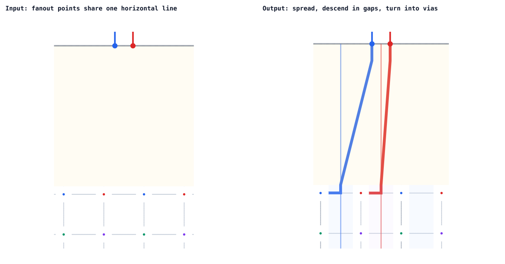

# @tscircuit/crossbar-mapping-solver

Maps a horizontal line of incoming fanout traces through a spread zone and
column gaps to matching vias in an alternating crossbar matrix.

[Open the Cosmos solver debugger](https://crossbar-mapping-solver.vercel.app)

## Input

```ts
interface FanoutPoint {
  x: number
  y: number
  netId: string
}

interface CrossbarVia {
  y: number
  diameter: number
  netId: string
}

interface CrossbarColumn {
  x: number
  vias: Array<CrossbarVia>
}

interface InputProblem {
  fanoutPoints: Array<FanoutPoint>
  columns: Array<CrossbarColumn>
}
```

Every fanout point must share the same `y`, forming one horizontal line above
all crossbar vias. The empty interval between that line and the highest via is
the spread zone. Each trace descends into a separate spread lane, moves to a
compatible internal column gap, descends between the columns, then turns left
or right into an adjacent via with the same `netId`.

For an alternating matrix, neighboring columns expose different nets to the
same gap:

```text
F1      F2      F3
<---- spread zone ---->
C1  C2  C3  C4  C5  C6
N1  N2  N1  N2  N1  N2
N3  N4  N3  N4  N3  N4
```

## Usage

```ts
import {
  CrossbarMappingSolver,
  type InputProblem,
} from "@tscircuit/crossbar-mapping-solver"

const input: InputProblem = {
  fanoutPoints: [
    { x: 4, y: 10, netId: "N1" },
    { x: 5, y: 10, netId: "N2" },
    { x: 6, y: 10, netId: "N3" },
  ],
  columns: [
    {
      x: 0,
      vias: [
        { y: 2, diameter: 0.8, netId: "N1" },
        { y: 0, diameter: 0.8, netId: "N3" },
      ],
    },
    {
      x: 2,
      vias: [
        { y: 2, diameter: 0.8, netId: "N2" },
        { y: 0, diameter: 0.8, netId: "N4" },
      ],
    },
    {
      x: 4,
      vias: [
        { y: 2, diameter: 0.8, netId: "N1" },
        { y: 0, diameter: 0.8, netId: "N3" },
      ],
    },
    {
      x: 6,
      vias: [
        { y: 2, diameter: 0.8, netId: "N2" },
        { y: 0, diameter: 0.8, netId: "N4" },
      ],
    },
    {
      x: 8,
      vias: [
        { y: 2, diameter: 0.8, netId: "N1" },
        { y: 0, diameter: 0.8, netId: "N3" },
      ],
    },
    {
      x: 10,
      vias: [
        { y: 2, diameter: 0.8, netId: "N2" },
        { y: 0, diameter: 0.8, netId: "N4" },
      ],
    },
  ],
}

const solver = new CrossbarMappingSolver(input)
solver.solve()

const output = solver.getOutput()
```

## Development

```sh
bun install
bun test
bun run typecheck
bun run format:check
bun run start
```

`bun run start` opens the React Cosmos page containing the generic solver
debugger. To make coincident routes legible, the debugger applies tiny
deterministic X/Y offsets to rendered paths. These offsets never change solver
output geometry.

## Simple output


