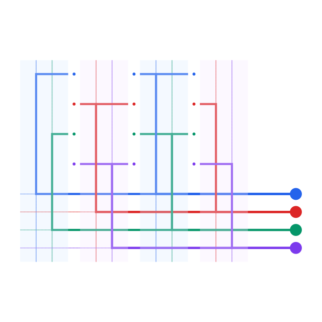

# @tscircuit/crossbar-mapping-solver

Maps columns of fanout vias into alternating even/odd crossbar channels, then
routes every via to the generated pad for its net.

## Input

```ts
interface FanoutPoint {
  y: number
  diameter: number
  netId: string
}

interface FanoutColumn {
  x: number
  vias: Array<FanoutPoint>
}

interface InputProblem {
  columns: Array<FanoutColumn>
}
```

Columns are sorted by `x`. Nets are assigned stable indices in first-seen
top-to-bottom order. Each column is bordered by an even and an odd channel, so
the net index determines whether a via turns left or right.

## Usage

```ts
import {
  CrossbarMappingSolver,
  type InputProblem,
} from "@tscircuit/crossbar-mapping-solver"

const input: InputProblem = {
  columns: [
    {
      x: 0,
      vias: [
        { y: 3, diameter: 0.8, netId: "D0" },
        { y: 1, diameter: 0.8, netId: "D1" },
      ],
    },
    {
      x: 4,
      vias: [
        { y: 3, diameter: 0.8, netId: "D0" },
        { y: 1, diameter: 0.8, netId: "D1" },
      ],
    },
  ],
}

const solver = new CrossbarMappingSolver(input)
solver.solve()

const output = solver.getOutput()
```

## Development

```sh
bun install
bun test
bun run typecheck
bun run format:check
bun run start
```

`bun run start` opens the React Cosmos page containing the generic solver
debugger.

## Simple output


